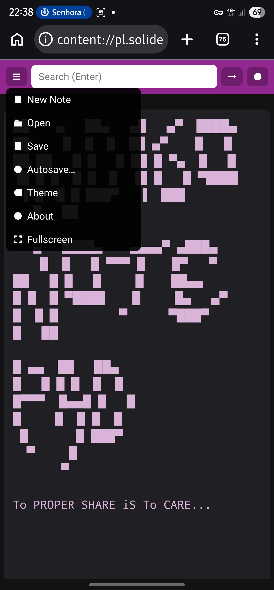
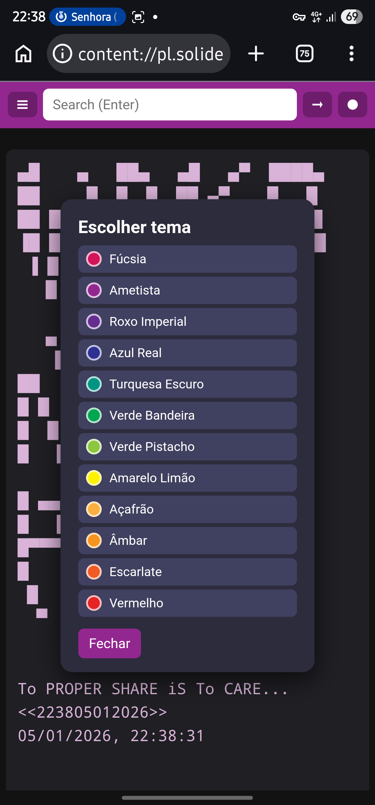
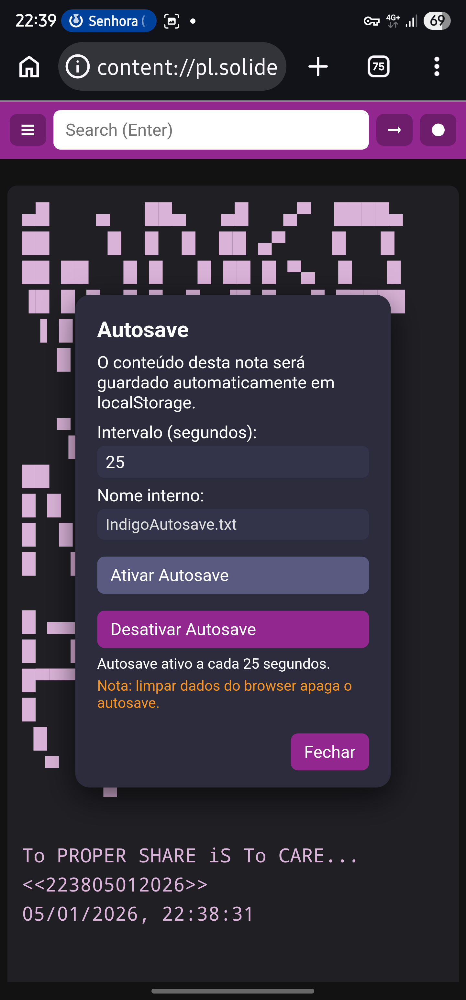

# iNDIGONOTEPAD
Indigo Notepad OR indigoPAD indigopad...

Pocket Programmer has done iT again.
Indigo Notepad. :-)

Indigo Notepad can be freely used on localhost on any private environment.

Licensed under the terms of the GNU Affero General Public License (AGPL-3.0).

This means: You are free to run, study, and modify Indigo Notepad.

You may redistribute copies — modified or unmodified — as long as you keep this license.

If you modify the software and use it on a private or public server, you must make your modified source code available under the same license.

Pocket Programmer OR nuromen — All copyleft rights.

. 
. 
. 
. 

[!/¡]
